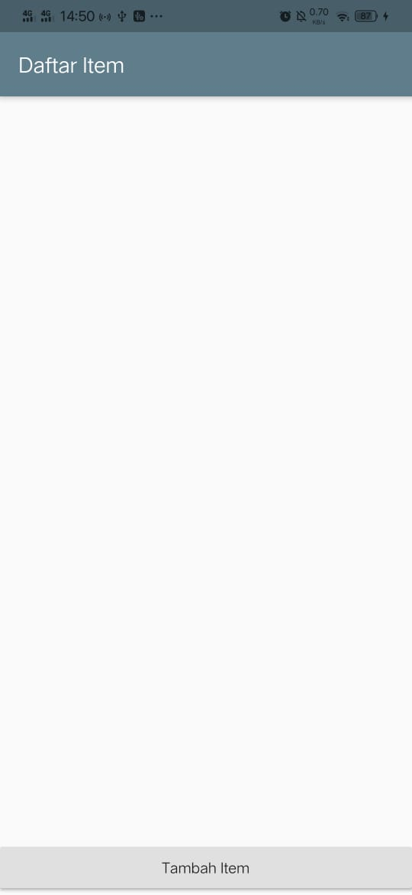
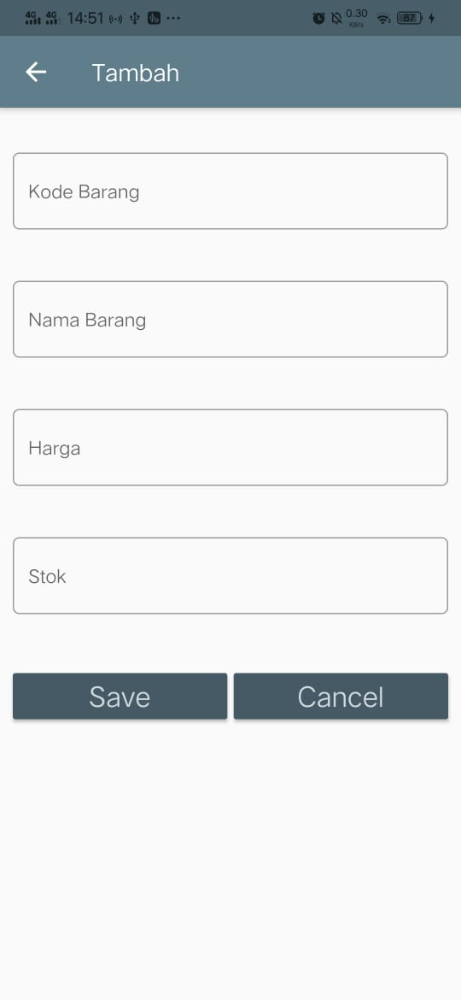
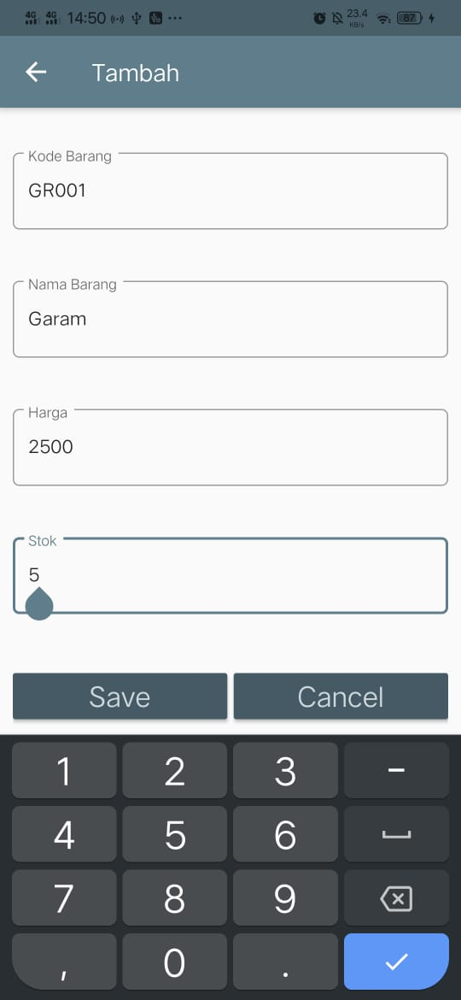
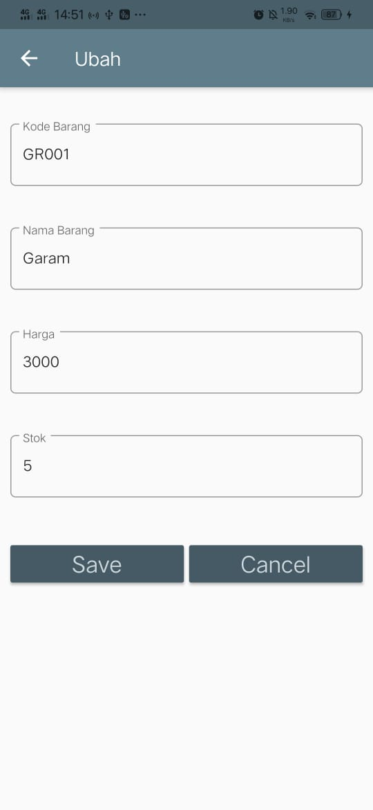
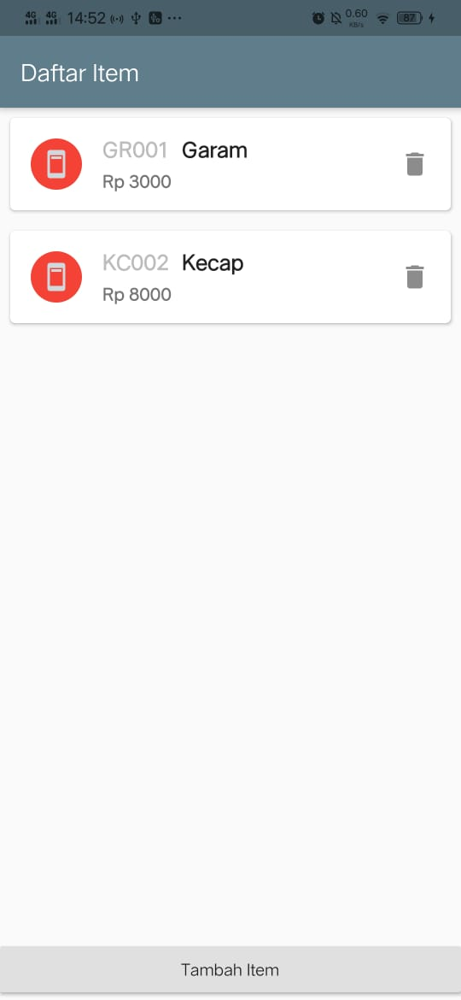
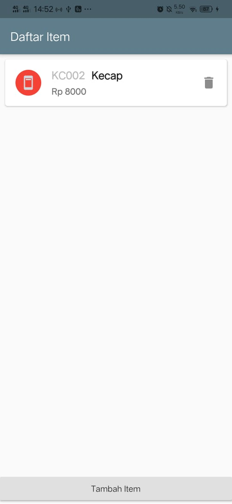

# Jobsheet 6 - Database SQLITE

## Halaman Awal

Pada halaman awal terdapat tombol Tambah Item untuk menambahkan item.

## Halaman Tambah Item

Pada halaman ini terdapat form untuk mengisi kode barang, nama barang, harga dan stok.
Kemudian pada halaman ini terdapat tombol save untuk menyimpan form yang telah diisi.
Dan tombol cancel untuk membatalkan pengisian form.

Setelah mengklik tombol save, maka item yang berhasil ditambahkan akan tampil pada halaman awal.

## Halaman Rubah

Untuk mengedit item, maka klik lah item yang ingin diedit.
Kemudian akan muncul form untuk melakukan pengeditan.

Jika sudah melakukan edit, klik save. Maka item yang sudah diedit akan muncul pada halaman awal.

## Hapus

Ketika ingin menghapus item, maka klik icon delete.

Jika proses penhapusan berhasil, maka item akan hilang dari daftar yang ada pada halaman awal.

